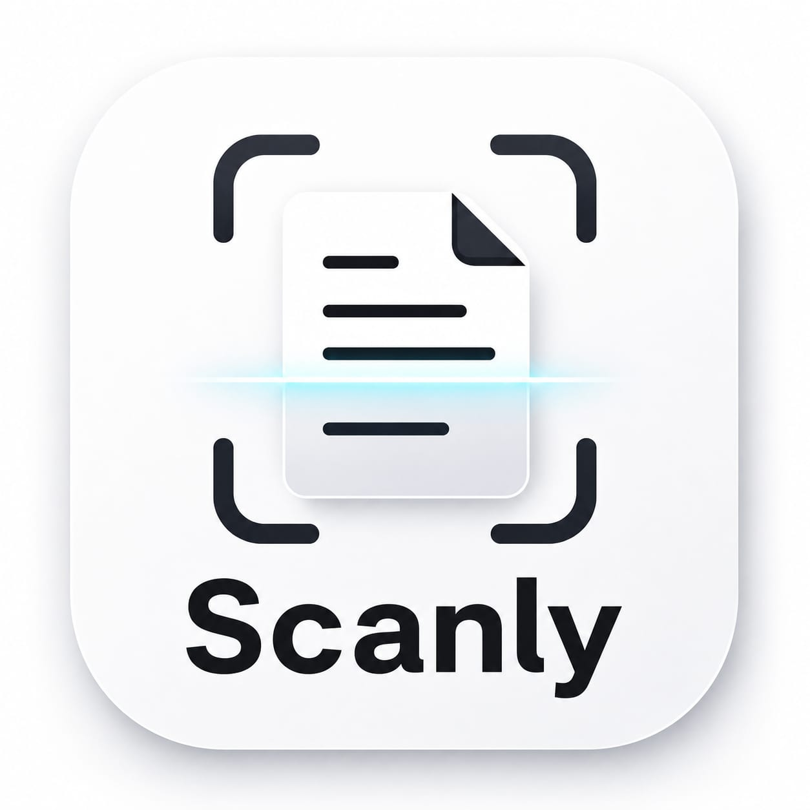

# Scanly — Smart Document Scanner

<div align="center">



### Paper, digitized properly.
**A focused, offline-first smart document scanner for Android.**

[](https://thekubics.space/)
[](https://scanly.thekubics.space/)
[](https://developer.android.com/)
[](https://kotlinlang.org/)
[](https://developer.android.com/jetpack/compose)

---

[Official Website](https://scanly.thekubics.space/) &bull; [Parent Studio](https://thekubics.space/) &bull; [Capabilities](#capabilities) &bull; [Architecture](#architecture) &bull; [Build Setup](#build--installation)

</div>

---

## Overview

**Scanly** turns physical documents into clean, organized digital files. Engineered under **TheKubics** design philosophy, it focuses on the part that matters: deterministic capture, instant edge detection, perspective correction, and high-fidelity PDF export without marketing noise or forced cloud accounts.

* **Category:** Smart Document Scanner
* **Parent Brand:** [TheKubics Software Studio](https://thekubics.space/)
* **Official Website:** [https://scanly.thekubics.space/](https://scanly.thekubics.space/)
* **Primary Tagline:** *"Scan documents. Cut the clutter."*
* **Architecture:** 100% Offline-first with optional decoupled Cloud Backup.

---

## Capabilities

| # | Feature | Technical Implementation |
|---|---|---|
| **01** | **Smart Scanning** | Live optical camera capture via CameraX with dynamic viewfinder. |
| **02** | **Auto Edge Detection** | Real-time quad contour sensing powered by Google ML Kit. |
| **03** | **Perspective Correction** | Planar homography matrix transformation to rectify angled document shots. |
| **04** | **Image Processing** | ColorMatrix filters: Magic Color, Clean B&W, Grayscale, Contrast stretch. |
| **05** | **Multi-Page Composer** | Full page hierarchy: add, delete, rotate, duplicate, and reorder scans. |
| **06** | **Lossless PDF Export** | Standardized ISO A4 and US Letter document generation with custom naming. |
| **07** | **Local Document Library** | SQLite database via Room with folder organization, search, and tags. |
| **08** | **Biometric Security** | BiometricPrompt integration (fingerprint / face unlock) for private scans. |
| **09** | **Cloud Storage (Optional)**| WorkManager background sync engine with network metering and quota telemetry. |

---

## Architecture & Design

Scanly follows strict **Clean Architecture** principles structured into three decoupled layers:

```
com.docscanner.app
├── data
│   ├── local
│   │   ├── dao          # Room DAOs (Document, Page, Folder, Cloud, SyncQueue)
│   │   ├── db           # AppDatabase (Room v2 migration & schemas)
│   │   └── entity       # Relational SQLite table entities
│   ├── mapper           # Entity <-> Domain bidirectional mappers
│   ├── repository       # Concrete repository implementations
│   └── service          # CloudStorageServiceImpl & AuthServiceImpl
├── di                   # Dagger Hilt dependency injection modules
├── domain
│   ├── model            # Immutable pure Kotlin domain models
│   ├── repository       # Repository abstractions / contracts
│   └── service          # Service interfaces (Storage, Auth, Filters)
├── presentation
│   ├── auth             # Sign In, Sign Up, Profile UI
│   ├── cloud            # Cloud Library & Storage Telemetry Dashboard
│   ├── common           # Reusable Compose components (Pills, Dialogs)
│   ├── editor           # Document adjustment, filters, & page composer
│   ├── folders          # Folder management & batch move
│   ├── home             # Document grid, recent scans, search
│   ├── navigation       # Type-safe Jetpack Compose navigation graphs
│   ├── scanner          # CameraX viewfinder with real-time ML Kit overlays
│   ├── settings         # Theme selection, save defaults, cache cleaner
│   └── theme            # TheKubics dark-first design tokens & typography
├── service
│   ├── filter           # ImageFilterService (ColorMatrix & Bitmap transforms)
│   ├── pdf              # PdfExportService (A4 / Letter generator)
│   └── sync             # CloudSyncWorker & periodic WorkManager scheduler
└── util                 # NetworkMonitor, FileUtils, BitmapExtensions
```

---

## Tech Stack

Scanly is built with tools that ship:

* **Language:** Kotlin 2.0.21
* **UI Framework:** Jetpack Compose with Material Design 3
* **Computer Vision:** Google ML Kit Document Detection
* **Dependency Injection:** Dagger Hilt 2.51.1 (`hilt-android`, `hilt-work`)
* **Local Persistence:** AndroidX Room 2.6.1 SQLite Database
* **Background Tasks:** AndroidX WorkManager 2.10.0
* **Image Pipeline:** Coil 3 for Compose
* **Camera Pipeline:** AndroidX CameraX (Camera2, Lifecycle, View)
* **Security:** AndroidX Biometric 1.1.0

---

## Build & Installation

### Prerequisites
* Android Studio Ladybug or newer
* JDK 17 or JDK 21 (configured as `JAVA_HOME`)
* Android SDK 35 (compileSdk: 35, minSdk: 26)

### Clone & Build
```bash
# Clone the repository
git clone https://github.com/TheKubics-org/Scanly.git
cd Scanly

# Build the Debug APK
./gradlew assembleDebug

# Output APK path
app/build/outputs/apk/debug/app-debug.apk
```

---

## Studio & Credits

Scanly is an official product built and maintained under **TheKubics**.

* **Studio:** [TheKubics](https://thekubics.space/)
* **Email:** [thekubics.dev@gmail.com](mailto:thekubics.dev@gmail.com)
* **Organization:** [github.com/TheKubics-org](https://github.com/TheKubics-org)

---

<div align="center">

&copy; 2026 **TheKubics**. All rights reserved.  
*Software, cut precisely. Built to ship.*

</div>
